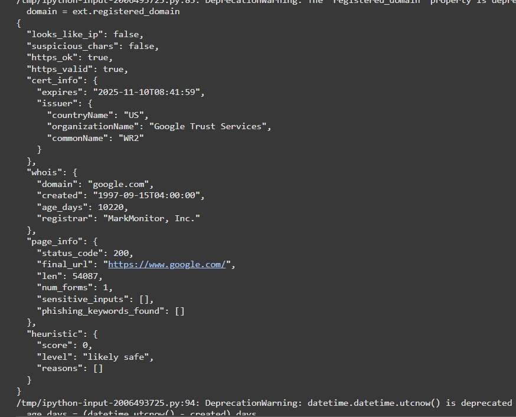

# url_safety_check.py
A Python tool to analyze URLs for safety using SSL checks, WHOIS domain info, phishing heuristics, and optional VirusTotal / Google Safe Browsing APIs.

🔒 URL Safety Checker is a Python-based tool that evaluates the security of any URL.  
It performs multiple layers of analysis, including:
- Heuristic detection of suspicious patterns in URLs.
- SSL/TLS certificate validation.
- WHOIS domain age lookup.
- Webpage content analysis (forms, phishing keywords).

Helps in identifying potentially malicious, phishing, or unsafe websites.

## 📸 Screenshots

### Example Output in Action
The screenshot demonstrates:
- URL analysis with SSL certificate details. 
- WHOIS information (domain age, registrar).
- Page content checks (forms, phishing keywords).
- Heuristic scoring (final safety level).
- 
Below is a sample run of the **URL Safety Checker**, showing analysis results for a website:

